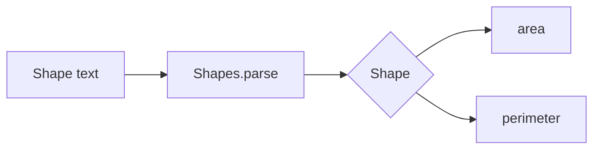
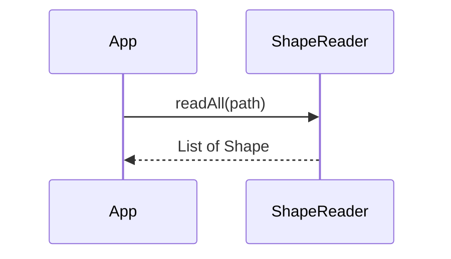
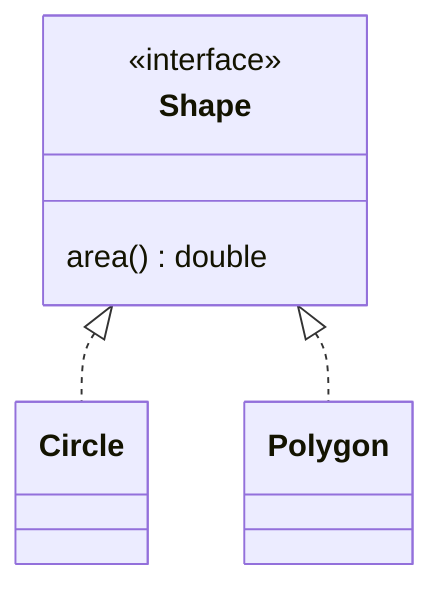
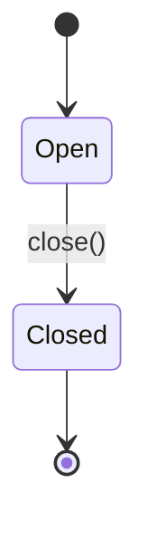

## A flowchart

```mermaid
flowchart LR
  accTitle: Measuring a shape
  accDescr: Shapes.parse reads text into a Shape, which area and perimeter measure.
  text[Shape text] --> parse[Shapes.parse]
  parse --> shape{Shape}
  shape --> area[area]
  shape --> perimeter[perimeter]
```

## A sequence diagram

```mermaid
sequenceDiagram
  accTitle: Reading a file of shapes
  participant App
  participant Reader as ShapeReader
  App->>Reader: readAll(path)
  Reader-->>App: List of Shape
```

## A class diagram

```mermaid
classDiagram
  accTitle: The shape hierarchy
  class Shape {
    <<interface>>
    area() double
  }
  Shape <|.. Circle
  Shape <|.. Polygon
```

## A state diagram

```mermaid
stateDiagram-v2
  accTitle: A polygon's states
  [*] --> Open
  Open --> Closed: close()
  Closed --> [*]
```
